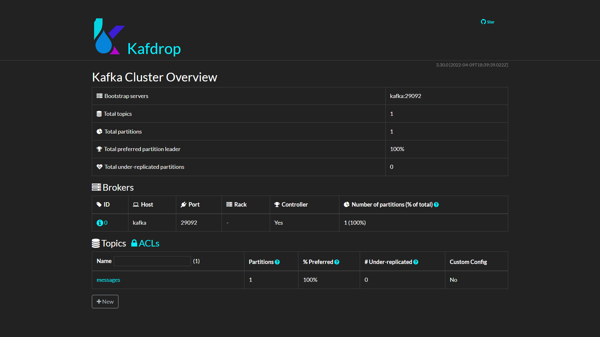
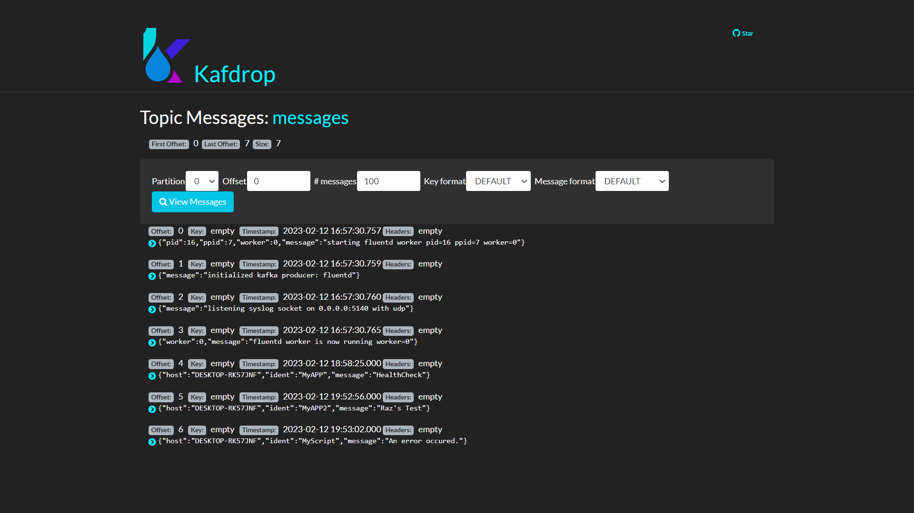

# Fluentd-Kafka
This repository contains a Docker Compose configuration file and a custom Fluentd Docker image that together provide a solution for forwarding syslog messages to a Kafka cluster.

## Prerequisites
Before deploying this project, you must have Docker and Docker Compose installed on your system. To install Docker and Docker Compose, please follow the instructions for your operating system:

**__[Docker installation instructions](https://docs.docker.com/engine/install/)__**

**__[Docker Compose installation instructions](https://docs.docker.com/compose/install/)__**
## Deployment
To deploy the project, please follow these steps:

Clone this repository to your local machine.

Change to the repository directory: cd Fluentd-Kafka.

Build the custom Fluentd Docker image:

```
docker build -t fluentd-kafka:v1.0 .
```

Start the Docker Compose environment:

```
docker-compose up -d
```

Verify that the containers are running:

```
docker-compose ps
```

The Docker Compose environment includes three services:

kafka: a Kafka broker that listens on ports 2181 and 9092.

kafdrop: a web-based UI for viewing Kafka topics that listens on port 9000.

fluent: a custom Fluentd container that listens for syslog messages on port 5140(UDP) and forwards them to the Kafka broker.
## Usage
Once the containers are running, you can start sending syslog messages to the Fluentd container on port 5140(UDP). The container will forward the messages to the Kafka broker, which can then be viewed in Kafdrop or consumed by other applications.


By default, the Fluentd container is configured to write all messages to a Kafka topic called "messages". You can change this by editing the fluent.conf file and modifying the default_topic setting.


Access Kafdrop on **'localhost:9000'**

## Customization
If you need to customize the Fluentd configuration, you can modify the fluent.conf file in the ./fluentd/conf directory. After making changes, restart the containers with:

```
docker-compose up -d
```

## Cleanup
To stop and remove the containers and their associated volumes and networks, run:

```
docker-compose down
```

## Conclusion
This project provides a simple solution for forwarding syslog messages to a Kafka cluster using Fluentd. By following the instructions in this README, you can quickly set up a development or test environment for processing syslog data with Kafka.


## Screenshots



